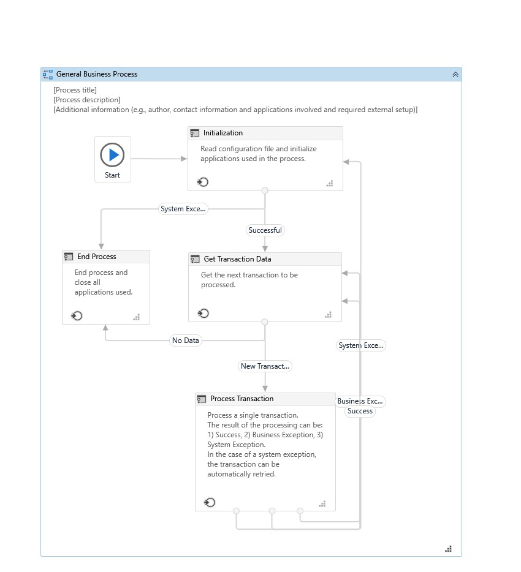
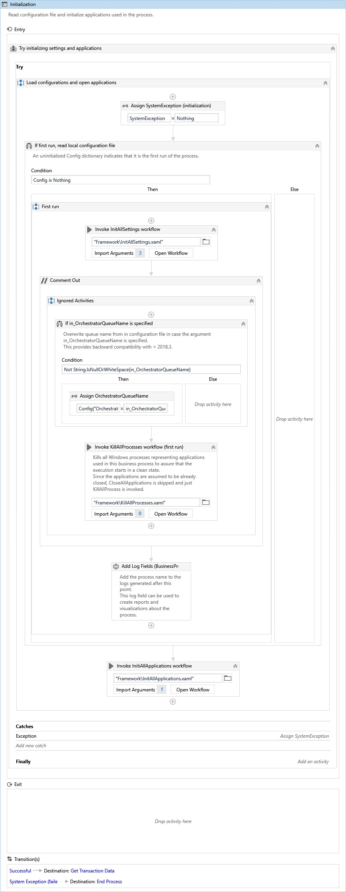

# ReFramework with Excel
 
Hey guys!! So through this blog i will be sharing a use-case to learn, as how we can use ReFramework for building most of our projects with proper structure and exception handling

## What is Re-Framework?
* This Framework is a Template provided by UiPath for ```transactional``` activities or workflow
* ReFramework consists of few pre-build workflows which are used to simplify the Automation Task in a proper manner
* It can be used for multiple input types which just needs to be iterable, such as
  1. List
  2. Queue
  3. Array
  and many more.

## When to Use?
* It can be used in most of the projects
* But the basic idea is, if you need to apply specific actions on every entry of a data set, then its the best option you have
* It works through index based search and process

Now without wasting any time, lets start with a UseCase and implement our own Bot

<b><u>Idea</u></b> : Send Customized Bulk Mails to Peoples while fetching data from Excel File

1. To Begin with, Open ```UiPath``` and Click on ```Robotic Enterprise Framework``` in the ```New From Template``` section
2. Give a name to the Process ( up to you ) like ```Bulk mailing using ReFramework``` and a suitable Description can be added as for the ```Best Practices``` if we talk about

... In few moments a pre-build template structure will be visible on screen with activities ( called State Machine ) like this 

Before moving forward, lets talk about these activites also known as ```State Machine```
* <b>State Machine</b> ~> A state machine is a type of automation that uses a finite number of states in its execution and an important aspect of state machines are transitions, as they also enable you to add conditions based on which to jump from one state to another. These are represented by arrows or branches between states.
* Any Process consists of majorly 4 states:
  1. Initialization ~> The state at which we initialize all the applications required in the process, or fetch the data need to be processed on.
      * Init State (InitAllSettings.xaml) ~> An Config File is loaded into our Framework (as Config Dictionary Variable ```String:Object```), which is just an excel file which contains informationn related to logging status/File or Folder Path/Url/Credentials/Assets etc.. things which can be changed
  
  
   * Since we are not using ```Orchestrator``` we can just use ```comment out``` activity to disable ```Orchestrator``` activity and ```kill all process```
      * <u>InitAllApplications</u> ~> This workflow is utilized to add activities that are to be executed only once for the process, to work. In our process,
        1. Drag an ```Message Box``` Activity with Text: ```"Select an Excel File"```
        2. Drag an ```Select File``` activity and create its output variable in right panel using ```ctrl+k```, naming ```InputFile```.
        3. Drag an ```read range``` activity (workbook) and set Workbook path as ```InputFile``` (press ctrl + spacebar) and create an output argument using ```ctrl +m``` and name it as ```out_dt_MailData``` also in the ```Arguments Panel``` set its Direction to ```Out```.
        4. Set the Range of ```read range``` activity as ```""``` or blank.
        5. Drag an ```Message Box``` activity again with text: ```Select an Message.txt file``` ( We will be taking message and subject for mail through text files )
        6. Repeat step ```b``` and create an variable ```ctrl+k``` and name it ```Message```
        7. Drag an ```Read text file``` activity and set input file path as ```Message``` variable and create an output argument ```ctrl+m``` naming ```out_Message```
        8. Repeat step 5,6 & 7 for Subject of our mail, with variable as ```Subject``` and argument as ```out_Subject```.
        
       Don't forget to set the Direction of ```out_Message```,```out_Subject``` and ```out_dt_MailData``` as Out in Arguments Panel and thus we are all set with our Initial Settings and can move on to Get Transaction State.
   * After the above process, save the ```InitAllApplications.xaml``` file and move back to position from where you opened it.
   * An ```Import Arguments``` button would seem to be highlighted with ```orange color```, Click on it and create variables for each empty entry with similar name (using ctrl + k) such as ```Message```, ```MailData```, ```Subject``` and click on ```Ok```.
   * Now we are ready with initial settings and time to work on ```Get Transaction Data State```.
    
    
  
